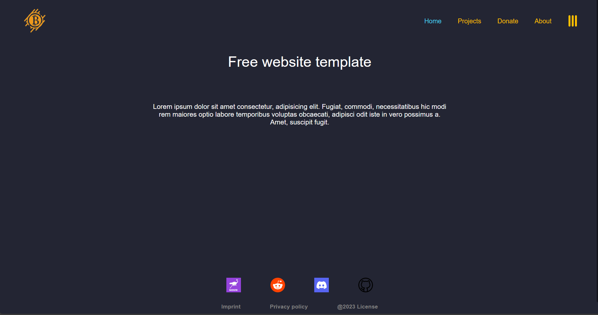
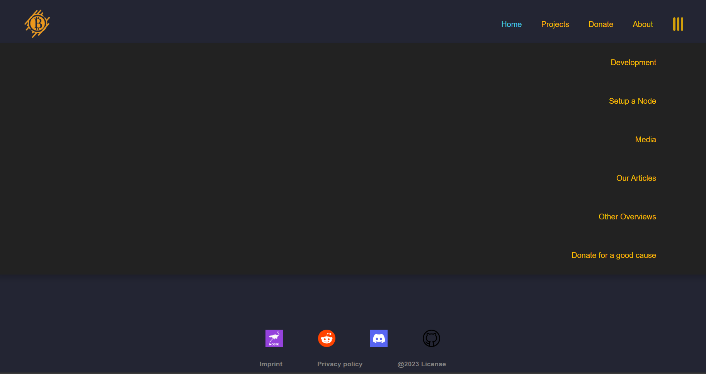
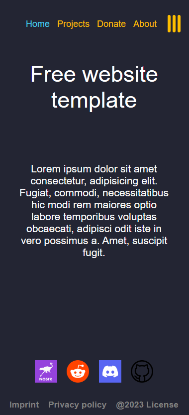
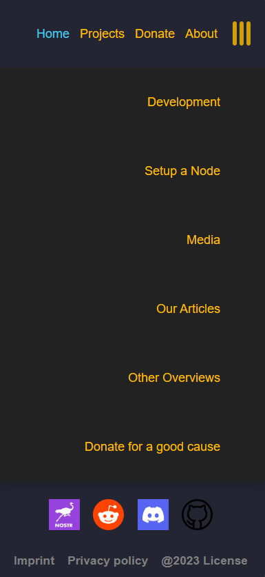

# Free website template
 

</img><a href="https://opensource.org/licenses/MIT" title="License: MIT"></img></a>

Original designed by Coco_Ardo.

## Review the website offline
1. [Download](https://github.com/RealCocoArdo/free-website-template/archive/refs/heads/main.zip) and save the code.
2. Open the folder were you saved the code.
3. Unzip the downloaded file to a directory of your choice. Ideally in the same folder were you saved the .zip file.
4. Open the folder. Press right click on the "index.html" file and select "Open with" and choose your favourite browser.

## Design compatibility

see more

### Browsers
The website should be displayed as intended in most browsers.

| Testet browsers                 | Not yet tested |
|---------------------------------|----------------|
| The onion routing (Tor)         | Safari (Apple) |
| Chromium based (Microsoft Edge) | Ecosia         |
| Mozilla Firefox                 | Brave          |
### Devices
| Typ          | Ratio     | Pixel      | Optimized          |
|--------------|-----------|------------|--------------------|
| Desktop      | 16:9      | 1920x1080  | :heavy_check_mark: |
| Tablet       | inbetween | inbetween  | :heavy_check_mark: |
| Mobile       | 9:16      | >1100x1080 | :heavy_check_mark: |
### Design
The design gets adjusted to your browser style mode

| Mode           | Optimized          |
|----------------|--------------------|
| Light          | :x:                |
| Dark (Default) | :heavy_check_mark: |

## FOSS

see more

This code has a [MIT License](LICENSE.txt).

## Screenshots

see more

## Roadmap

see more

* Detailed comments in all -html .css and .js files
* Article templates
* Templates to import pictures
* Templates for tables

